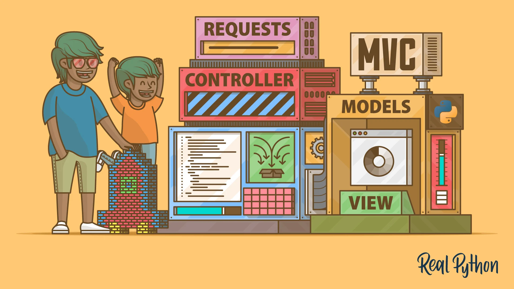

# Taking a closer look at : MVC Architecture

MVC (Model-View-Controller) is an architectural pattern widely used in software development, particually in web applications. It seperates an application into three interconnected components, allowing for modularization and seperation of cocerns.

## Components of MVC

### 1. Model

The **Model** represents the data and business logic and storing the data from your application. The data structure can be a simple data like an array or complex data with properties. The model is responsible for:

- Retrieving data from the database
- Recieving user input from the controller
- Validating Data

### 2. View

The **View** is the component that displays data to the user. It is responsible for taking all of your data and presenting it in a way that is more pleasing for the user. The View is responsible for:

- Rendering the user interface
- Recieving user input
- Updating the display when the model changes

### 3. Controller

The **Controller** acts as an buffer between the Model and the View. It listens to the user input from the View and makes decisons based on the input. The controller is responsible for:

- Handling user requests
- Updating the model based on input
- Selecting the appropriate view to the display to the user

## How MVC Works

1. **User Interaction**: The user interacts with the view (clicking a button)
2. **Controller Response**: The Controller recieves the input and processing it, can update the model.
3. **Model Update**: The Model updates its state and notifies the View of any changes.
4. **View Update**: The View renders the updated data from the Model for the user.

## Advantages of MVC

- **Seperation of Concerns**: Each component has distinct responsibilities, making it easier to manage and maintain your code.
- **Reusability**: Components can be reused across different parts of the application.
- **Testability**: With a clear seperation, unit testing can be applied more effectively to each component.

## Conclusion

MVC archicture provides a powerful framework for developing scalable and maintainable applications. By seperating the application into three interconnect components, developers can enhance the modularity and testability of their code.
